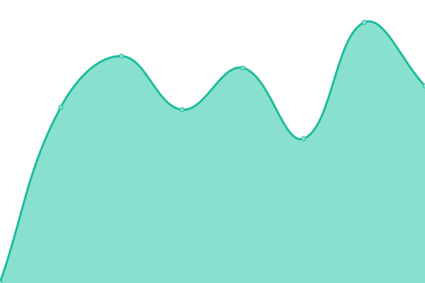
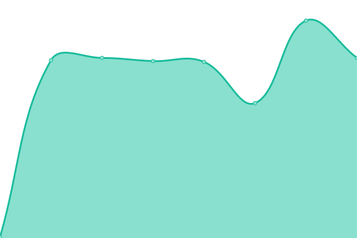
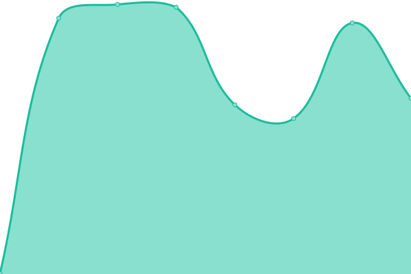

# [📈 Live Status](https://status.random.studio): <!--live status--> **🟧 Partial outage**

This repository contains the open-source uptime monitor and status page for [Random Studio](https://random.studio), powered by [Upptime](https://github.com/upptime/upptime).

With [Upptime](https://upptime.js.org), you can get your own unlimited and free uptime monitor and status page, powered entirely by a GitHub repository. We use [Issues](https://github.com/RandomStudio/randomstudio-upptime/issues) as incident reports, [Actions](https://github.com/RandomStudio/randomstudio-upptime/actions) as uptime monitors, and [Pages](https://status.random.studio) for the status page.

<!--start: status pages-->
<!-- This summary is generated by Upptime (https://github.com/upptime/upptime) -->
<!-- Do not edit this manually, your changes will be overwritten -->
<!-- prettier-ignore -->
| URL | Status | History | Response Time | Uptime |
| --- | ------ | ------- | ------------- | ------ |
|  [Random Studio](https://random.studio) | 🟩 Up | [random-studio.yml](https://github.com/RandomStudio/randomstudio-upptime/commits/HEAD/history/random-studio.yml) | 

 856ms
     
 | 

<a href="https://status.random.studio/history/random-studio">100.00%</a>
    

|  [Random Studio (www)](https://random.studio) | 🟩 Up | [random-studio-www.yml](https://github.com/RandomStudio/randomstudio-upptime/commits/HEAD/history/random-studio-www.yml) | 

 234ms
     
 | 

<a href="https://status.random.studio/history/random-studio-www">100.00%</a>
    

|  [Random Studio (http)](http://random.studio) | 🟩 Up | [random-studio-http.yml](https://github.com/RandomStudio/randomstudio-upptime/commits/HEAD/history/random-studio-http.yml) | 

 632ms
     
 | 

<a href="https://status.random.studio/history/random-studio-http">100.00%</a>
    

|  [Test bad site](http://random.studiof) | 🟥 Down | [test-bad-site.yml](https://github.com/RandomStudio/randomstudio-upptime/commits/HEAD/history/test-bad-site.yml) | 

 0ms
     
 | 

<a href="https://status.random.studio/history/test-bad-site">0.00%</a>
    

<!--end: status pages-->

[**Visit our status website →**](https://status.random.studio)

## 📄 License

- Powered by: [Upptime](https://github.com/upptime/upptime)
- Code: [MIT](./LICENSE) © [Random Studio](https://random.studio)
- Data in the `./history` directory: [Open Database License](https://opendatacommons.org/licenses/odbl/1-0/)
